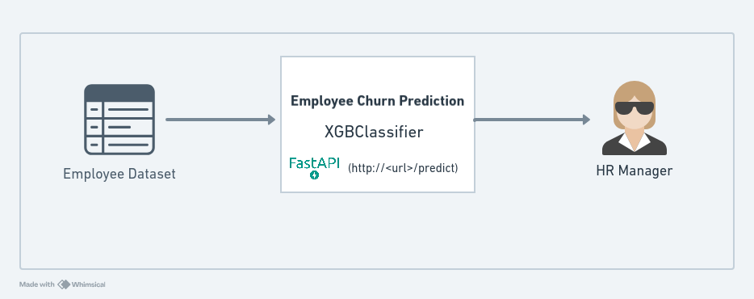
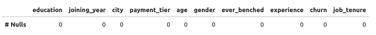
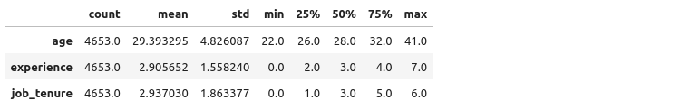
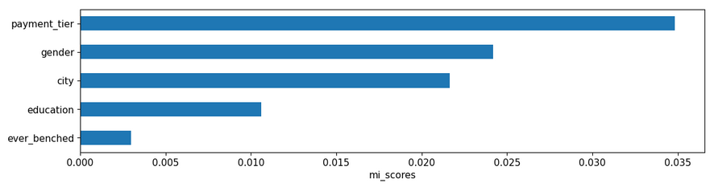
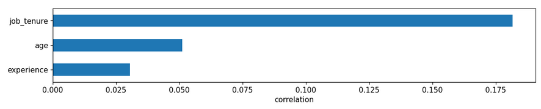
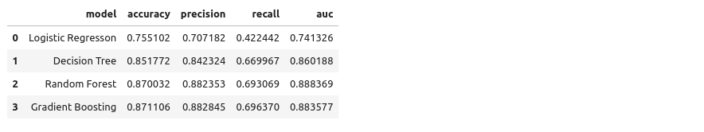
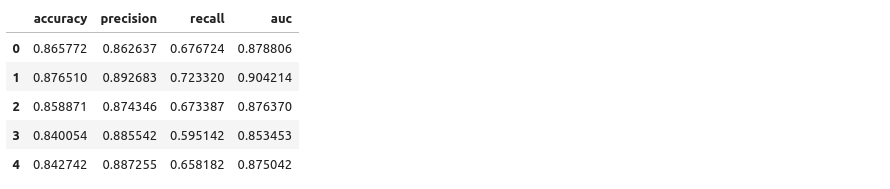
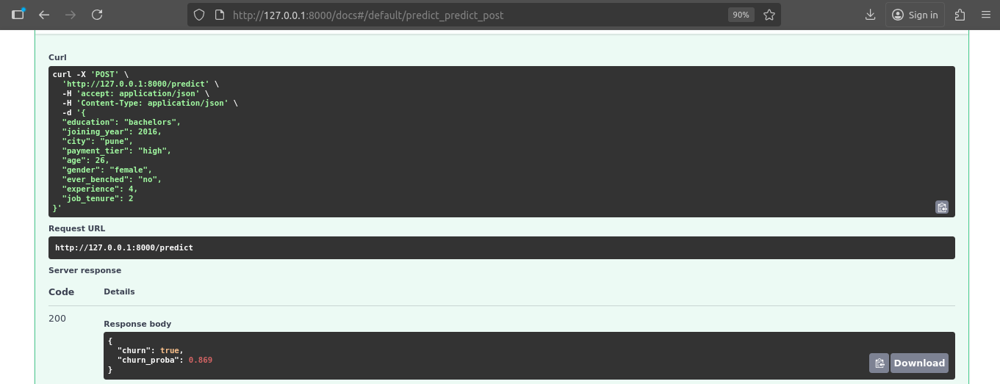
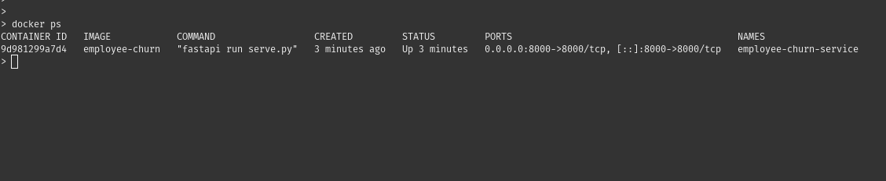

# Project Overview: Employee Churn Prediction

> [!NOTE]
> Disclaimer: This project has been developed to meet the requirements of the Machine Learning Zoomcamp midterm assignment.



## Problem Description

Employee turnover or "churn" is a major challenge for organizations. High churn rates increase recruitment and training costs, disrupt team productivity, and can harm morale.
This project aims to predict whether an employee is likely to leave the company based on their demographic, performance, and compensation data.

By building a predictive model, the HR department can identify at-risk employees early and take proactive measures to improve retention (e.g., career growth opportunities, workload balance, or salary adjustments).

### Who Benefits

- Human Resources (HR) teams: Gain insights to make data-driven retention strategies.

- Management: Reduce turnover-related costs and maintain workforce stability.

- Employees: Benefit from improved engagement and retention initiatives.

### How the Model Will Be Used

The final model will take as input employee data (e.g., salary level, age, work experiences) and output the probability that an employee will leave.
This probability can be integrated into an HR dashboard or used in batch processing to flag employees for review.

### Evaluation Metric

Since this is a classification problem and the dataset may not be perfectly balanced, the following metrics will be used:

- Accuracy: Measures overall correctness of predictions.

- ROC-AUC Score: Evaluates how well the model distinguishes between churned and non-churned employees across all thresholds.

- Precision and Recall: Provide insights into false positives and false negatives, respectively.

The ROC-AUC score will serve as the primary evaluation metric, as it offers a robust measure of separability between classes, even under moderate imbalance.

### Why This Problem Matters

Employee retention directly impacts a company’s financial health and culture.
Replacing an employee can cost 30–200% of their annual salary, depending on the role.
Predictive analytics can empower organizations to act before churn happens, making workforce management more strategic and humane.

## Dataset Description

### Context

The dataset contains detailed information about employees in a company, capturing factors that may influence employee retention and churn. It includes data on demographics, educational background, work history, and employment-related attributes. This information can be used to analyze patterns in employee behavior and build predictive models for workforce management.

### Features

The dataset includes both numerical and categorical features, such as:

- Education: The educational qualifications of employees, including degree, institution, and field of study.

- Joining Year: The year each employee joined the company, indicating their length of service.

- City: The location or city where each employee is based or works.

- Payment Tier: Categorization of employees into different salary tiers.

- Age: The age of each employee, providing demographic insights.

- Gender: Gender identity of employees, promoting diversity analysis.

- Ever Benched: Indicates if an employee has ever been temporarily without assigned work.

- Experience in Current Domain: The number of years of experience employees have in their current field.

- Leave or Not: a target column

### Purpose

This dataset is primarily used for predicting employee churn, helping organizations identify at-risk employees and design retention strategies. It is particularly useful for building classification models and exploring factors that influence employee turnover.

### Source
[Employee Dataset on Kaggle](https://www.kaggle.com/datasets/tawfikelmetwally/employee-dataset/data)

## EDA

#### Null Checking

Observation: The dataset contains no missing or null values.

#### Categorical Unique Counts

Observation: All categorical features contain between 2 and 3 distinct categories.

#### Numerical Description

Observation: The average employee age is around 29, indicating that most individuals fall within the mid-career range. Both experience and job tenure have a minimum value of 0, representing employees whose duration has not yet reached one full year.

#### Mutual Information on Categorical

Observation: The payment tier shows the highest mutual information score, indicating that employee churn is strongly influenced by salary level.

#### Correlation on Numerical

Observation: Job tenure shows a highest correlation with churn, and all numerical features exhibit negative correlations, meaning that as these values increase, the likelihood of churn decreases.

*Detailed information is available in the notebook.ipynb file.*

## Model Training

Four different models were trained: Logistic Regression, Decision Tree, Random Forest, and Gradient Boosting. Fine-tuning has also been performed for each model to optimize their performance.

#### Model Selection

Observation: As shown in the figure above, the ROC-AUC scores of Random Forest and Gradient Boosting are quite similar (both around 88%). Therefore, Gradient Boosting is selected as the final model.

#### Cross Validation

Observation: Based on the cross-validation results, the model demonstrates satisfactory and consistent performance, making it suitable as our final model.

*Detailed information is available in the notebook.ipynb file.*

## Dependencies
The necessary dependencies are listed below.

 - fastapi[standard]
 - jupyter
 - pandas
 - requests
 - scikit-learn
 - seaborn
 - xgboost

*You can install the dependencies using any Python package manager, such as pip or pipenv, or follow the instructions provided below.*

### Installation Guide
> `uv` must be installed first in order to perform the synchronization.

Mac & Linux
```
curl -LsSf https://astral.sh/uv/install.sh | sh
```
Windows
```
powershell -ExecutionPolicy ByPass -c "irm https://astral.sh/uv/install.ps1 | iex"
```

> Execute the following command to install the dependencies.

```
uv sync
```

> Activate the virtual environment using the following command.
```
source .venv/bin/activate
```

## Scripts

#### `train.py` 
Trains the model using the prepared dataset and saves the trained model artifact for later use.
```bash
python train.py
```

#### `predict.py`
Loads the saved model and performs inference on new or unseen data.
```bash
python predict.py
```

#### `serve.py`
Hosts the trained model as a web service, allowing users to make predictions through an API or web interface.
```bash
fastapi dev serve.py
```
*Ensure that you have installed the dependency `fastapi[standard]` before running this command.*


## Reproducibility

After installing all required dependencies, you can reproduce the results by running the notebook (notebook.ipynb) or executing any of the scripts (train.py, predict.py, serve.py) as per the provided instructions.

## Model Deployment

> Start the production server using the following command:
```bash
fastapi run serve.py
```


> Then, open your browser and navigate to http://127.0.0.1:8000/docs to access the API documentation and test the /predict endpoint, or use the command below in the terminal.
```bash
curl -X 'POST' \
  'http://127.0.0.1:8000/predict' \
  -H 'accept: application/json' \
  -H 'Content-Type: application/json' \
  -d '{
  "education": "bachelors",
  "joining_year": 2016,
  "city": "pune",
  "payment_tier": "high",
  "age": 26,
  "gender": "female",
  "ever_benched": "no",
  "experience": 4,
  "job_tenure": 2
}'
```

## Containerization

> As a prerequisite, ensure Docker is installed on your device. Then, build the Docker image using the following command in the project directory.
```
docker build -t employee-churn-prediction .
```

> To start the Docker container, use the command below. Once it’s running, you can access the `/predict` endpoint at http://127.0.0.1:8000/docs
```
docker run -dit --rm --name employee-churn-prediction-service -p8000:8000 employee-churn-prediction
```
> To verify whether the container is running, execute the following command.
```
docker ps
```


## Cloud Deployment
-- Coming soon...

## Acknowledgements

I would like to sincerely thank Alexey Grigorev for the invaluable course materials and guidance provided in the Machine Learning Zoomcamp, which greatly contributed to the completion of this project.